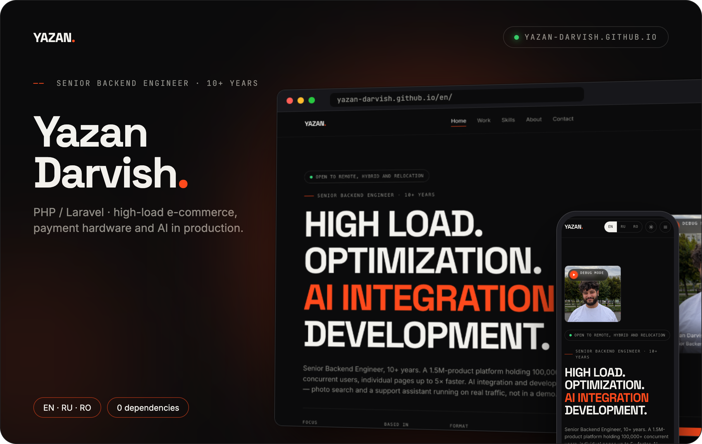
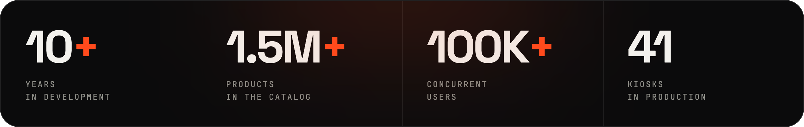
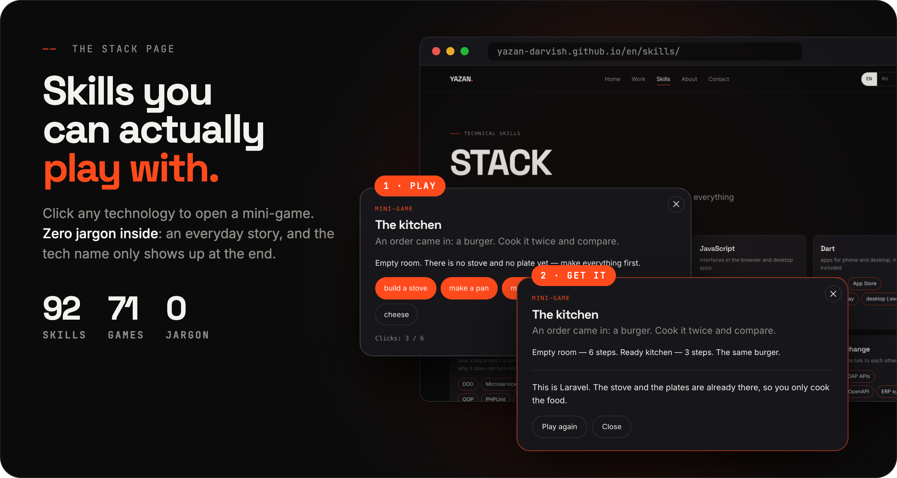
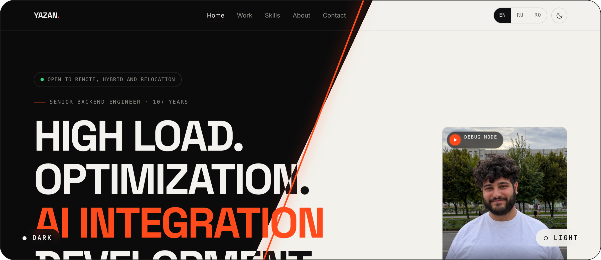

  

  

 

## A portfolio you can play with

Instead of a list of buzzwords — **92 skills, each with its own mini-game**. Click a pill and a window opens with an everyday story simple enough for a kid. The technology's name only appears at the very end: "This is Laravel, and here's why it exists."

| | Game | The point in 10 seconds |
|---|---|---|
| **Laravel** | The kitchen | a burger in an empty room takes 6 steps, in a ready kitchen — 3 |
| **PostgreSQL** | All or nothing | the power cuts out mid-transfer: the money is gone — or rolled back |
| **Kubernetes** | The caretaker | a house falls at 3 a.m.: down till morning, or back up on its own |
| **Kafka / RabbitMQ** | Feed vs. queue | everyone reads the event — or exactly one worker takes the job |
| **CashCode** | Bill acceptor | crumpled bill rejected, suspicious one refused, change counted out |

**71 unique mechanics**, none repeated: weight budget, timed stream, matching pairs, a switch, a slider, a branching dialogue.

<b>All games by block →</b>

 

| Block | Games | What's inside |
|---|:---:|---|
| **PHP** | 7 | Laravel — the kitchen, Symfony — a box of parts, Yii2 — forms that stamp themselves, CodeIgniter — a 3 kg bridge, OpenCart — stocking the shelves, Bitrix — warehouse + accounting + store, WordPress — a page built with the mouse |
| **Python** | 6 | OpenAI — neighbour, dictionary and know-it-all, RAG — answers from your own folder, vector search — lace vs. a mug, LLM in production — the night shift, AI assistant — a customer at 2:15 a.m., AI search — "something warm" |
| **JavaScript** | 6 | HTML/CSS — a bare page gets dressed, Vue — a live total, React — fix the brick, not every card, Node.js — the hall and backstage, Electron — a web page in an app window, .exe — a till that works offline |
| **Dart** | 5 | Flutter — one button on iPhone and Android, App Store — three reviewer notes, Google Play — the rollout slider, macOS — code signing, .exe — three platforms from one folder |
| **Architecture** | 6 | DDD — Entity#42 becomes "order", microservices — a tower vs. a village, SOLID — the screw and the cart, OOP — one mould, four cookies, PHPUnit — edits in the dark, PSR — five handwritings in one notebook |
| **Infrastructure** | 9 | Docker — "works on my machine", Kubernetes — the caretaker, Kafka — the feed, RabbitMQ — the queue, CI/CD — customers find the bug, S3 — disk full of photos, SES — mail lands in spam, Sentry — the error reports itself, Bash — the `*.jpg` pattern |
| **Databases & search** | 6 | SQL — the shelf returns 2 of 6, PostgreSQL — all or nothing, MySQL — a read replica, Redis — a note instead of the basement, Elasticsearch — words inside the books, Algolia — suggestions as you type |
| **Data exchange** | 5 | REST — the service window, Swagger — the sign on the window, ERP — ARTNR/BEZ/MENGE, CSV/XML — one jacket in two wrappers, direct DB access — the partner renamed a shelf |
| **External services** | 8 | Twilio — the SMS code, OneSignal — notification permission, SendGrid — 1000 sent → 47 clicks, Resend — domain verification, SailPlay — loyalty points, UDS — the card by phone number, Google Maps — pick the address with a finger, Trello — tickets sort themselves |
| **Analytics** | 3 | GA4 — a funnel leaking at checkout, Google Ads — a billboard vs. a targeted ad, reports — one week, three cuts |
| **Payment hardware** | 4 | SerialPort — garbage from the cable, Arcus — double charge, CashCode — the bill acceptor, Datecs — a receipt you can't erase |
| **Languages** | 5 | Russian, Romanian, English, Arabic, Ukrainian — the games show not the level but its honest limit |
| **Industries** | 1 | one game for 22 industries: seven documents from different businesses — guess where each came from |

 

## Two themes, three languages, any screen

- 📁 **13 projects** — from large-scale e-commerce to a self-service system running on 41 kiosks
- 💼 **11 companies** since 2015
- 🌍 **EN · RU · RO** — switch language on any page without being thrown back to home
- 🐛 **Easter egg** — click the photo on the home page to start debug mode: a bug-hunting game where the weapons are PHP, Python, SQL, JS and Flutter

 

## Zero dependencies

No React, no bundler, no `node_modules`. The repository holds plain, ready-to-serve HTML and GitHub Pages simply hosts it. The whole site weighs **2.1 MB** including photos and three PDF resumes — and it even opens with a double-click on the file, no server needed.

 

## Get in touch

Resume in PDF in three languages — on the <a href="https://yazan-darvish.github.io/en/contact/">contact page</a>

